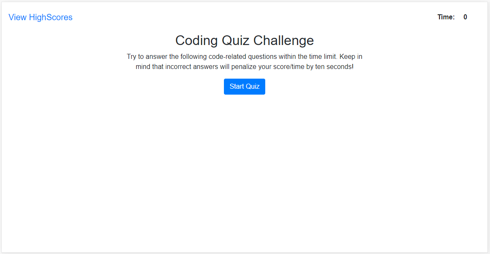
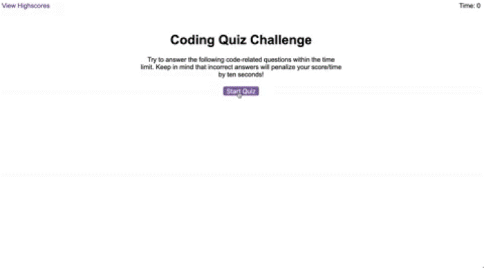

# JavaScript-Quiz

Link: https://jeashwor.github.io/JavaScript-Quiz/

Github Repo: https://github.com/jeashwor/JavaScript-Quiz



### Given Prompt:
As you proceed in your career as a web developer, you will probably be asked to complete a coding assessment, which is typically a combination of multiple-choice questions and interactive challenges. Build a timed code quiz with multiple-choice questions. This app will run in the browser and feature dynamically updated HTML and CSS powered by your JavaScript code. It will also feature a clean and polished user interface and be responsive, ensuring that it adapts to multiple screen sizes.

### Given Acceptance Criteria:
```
GIVEN I am taking a code quiz
WHEN I click the start button
THEN a timer starts and I am presented with a question
WHEN I answer a question
THEN I am presented with another question
WHEN I answer a question incorrectly
THEN time is subtracted from the clock
WHEN all questions are answered or the timer reaches 0
THEN the game is over
WHEN the game is over
THEN I can save my initials and score
```

### Given animation for reference:



### My Approach:

1. Begin by creating necessary index.html, style.css, script.js, and highScore.html pages that will be used for application. 
2. Within index.html we will need:
    - a header / navbar that will contain a link to the High Score Page and the game timer.
    - Div containing Quiz Start elements (Header, game description, and Start Button).
    - Div to house questions and multiple choice questions. 
        - Header to receive question.
        - (4) buttons with unique ids to house each possible answer. 
        - Div area for Correct answer display.
        - Div area for Wrong answer display.
    - Div to house High score form elements (Header, initial form field with label, submit button).
    - appropriate links to bootstrap CSS, jQuery, style.css, and script.js.
3. style.css file to be used for the following:
    - Set body font-family.
    - Remove focus element from buttons so that they are not still highlighted when questions are refreshed. 
    - Add further styling to highScore.html beyond bootstrap css. 
4. JavaScript functionality needed:
    - Establish global variables to access API elements needed. 
    - Write array containing objects that will house the questions, (4) possible answer, and the correct answer for 10 total questions. 
    - Create start function that wil call timer function in addition switch screen view to questions.
    - Create timerUpdate function to begin timer and display elements in header. 
    - Create a function to check if button clicked for answer matches correct answer value stored in question object.
    - Create function to take data from input field for initials and store in local storage.
        - Tie this function to changing html page to display high scores. 
    - Create function to populate object items into HTML from local storage in order to display users and scores. 
    - Create function to clear current scores on page and in local storage. 
    - Create function to sort High Score object in order to have highest score display first. 


